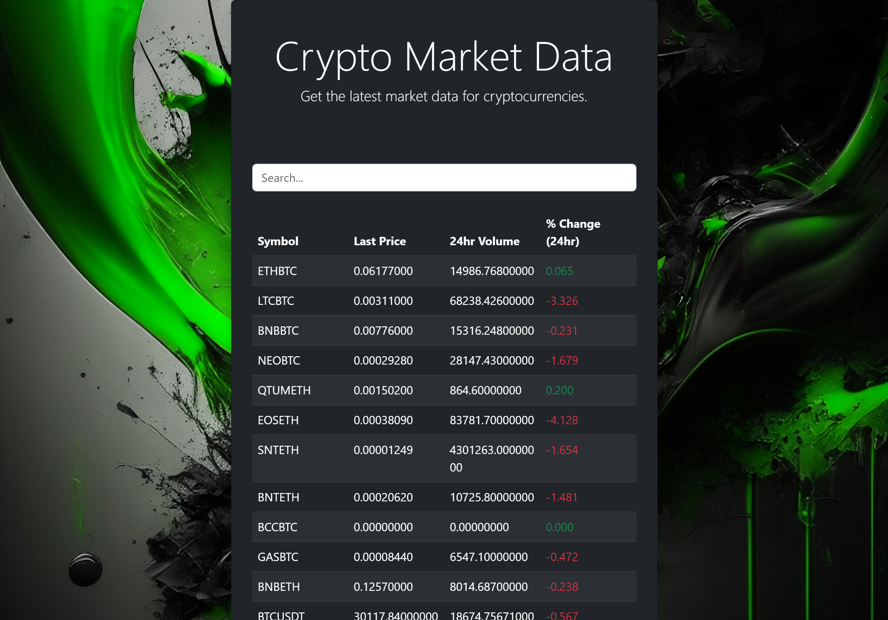

# Crypto Market Data App

The Crypto Market Data app is a web application that provides the latest market data for cryptocurrencies. It allows users to search for cryptocurrencies and view their symbol, last price, 24-hour volume, and percentage change over a 24-hour period.

## Features

- Real-time market data fetched from the Binance API
- Search functionality to filter cryptocurrencies based on symbol or name
- Responsive design for optimal viewing experience on different devices
- Dark-themed user interface with a background image
- Highlighting of negative and positive percentage changes

## Technologies Used

- React
- Bootstrap
- Binance API

## Installation

1. Clone the repository:
https://github.com/fasiyo/Crypto-market-data.git

2. Navigate to the project directory:
cd crypto-market-data-app

3. Install dependencies:
npm install

4. Start the application:
npm start

5. Open your web browser and access the app at `http://localhost:3000`

## Usage

- Upon launching the app, the latest market data for cryptocurrencies against other crypto currencies will be displayed in a table.
- Use the search input to filter cryptocurrencies based on symbol or name. The table will update dynamically as you type.
- The table columns show the symbol, last price, 24-hour volume, and percentage change of each cryptocurrency.
- Negative percentage change is displayed in red, indicating a decrease, while positive percentage change is displayed in green, indicating an increase.
- The app is responsive and will adapt to different screen sizes for optimal viewing experience.

## Contributing

Contributions to the Crypto Market Data app are welcome! If you find any issues or have suggestions for improvements, please open an issue on the GitHub repository or submit a pull request.

## License

This project is licensed under the MIT License. See the [LICENSE](LICENSE) file for more details.

## Credits

- [React](https://reactjs.org) for the JavaScript library used in building the app.
- [Bootstrap](https://getbootstrap.com) for the CSS framework used for styling and responsive design.
- [Binance](https://www.binance.com) for the API used to fetch real-time market data for cryptocurrencies.

### `npm run build` fails to minify

This section has moved here: [https://facebook.github.io/create-react-app/docs/troubleshooting#npm-run-build-fails-to-minify](https://facebook.github.io/create-react-app/docs/troubleshooting#npm-run-build-fails-to-minify)
